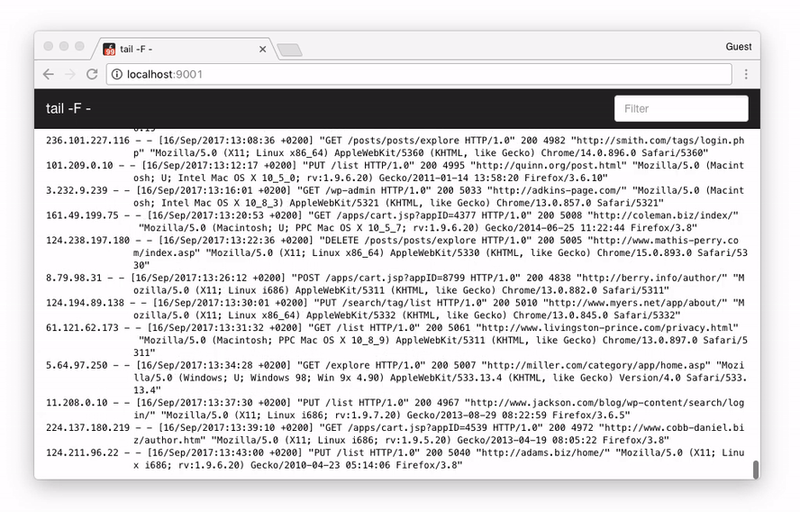
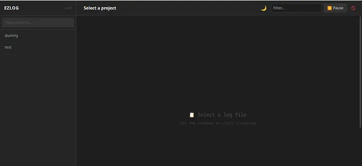
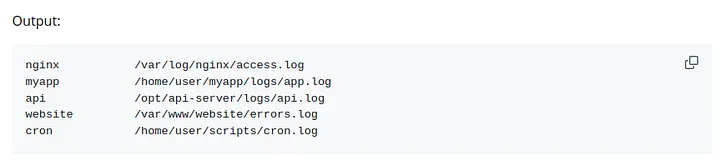
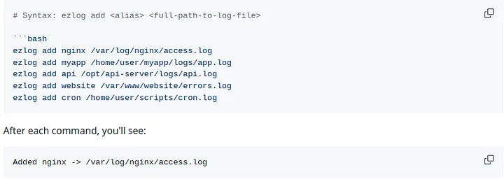
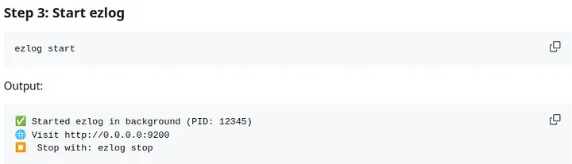
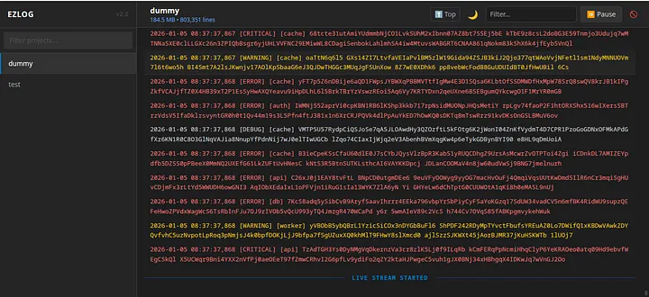
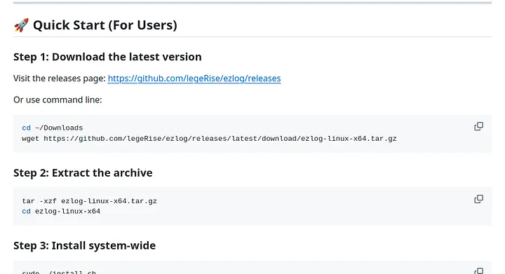

Even though, I completed my degree in CS still I call my self a self-learned developer. And that’s one of the reasons that I was never confident about the approches I used to solve a problem. Be it

- Deploying a webapp on Server
- Connecting Domain to an ip
- Planning backup Mechanism for applications

Apart from above common confusions I also used to have this weird confusion about the `Logs` for an application? How am i supposed to accurately track them? When can I say that I understand the `Logging` module well enough besides half of my applications and experiments still use `print()`

More on that another confusion was When I am actively developing an application how do I keep it live on the server? do I use

1. Systemd
2. PM2 ( a simpler alternative)
3. Nohup
4. Tmux

`systemd` was the most reliable but preparing service files for it is one thing, monitoring the logs using `journalctl` is another. `PM2` I had discovered it after `systemd` so it felt simpler but due to some not sure what happened circumstances we as a team couldn’t work well on it especially when we had to update the code several times. `nohup` has a **no** at the start for a reason. Ended up on `Tmux` yes so the utility that was built for multiple terminals in one window we utilized it as simple process manager.

It was very simple. Inside tmux session we would add a separate window for each project with a descriptive name and now it was easier for us to debug because whenever something went wrong

**there was a 3 step process**

1. *SSH into the server*
2. *Attach the tmux session*
3. *Select the project window and see the logs on console*


**Everything was great until logging into server again and again started to feel not right.**

This is the moment where I started to wonder If there was a way to view logs directly on the browser and there my search begins. I searched here and there and to be honest, I was either

1. **Too naive to get comfortable with any of the famous Log viewers** 

    OR

2. **Too developer to act as just a normal user for once.**


Whatever the reason I couldn’t find anything until I hopped on to
[frontail](https://github.com/mthenw/frontail)

A simple web based log viewer that you can simply install on your server and just point it to your log file following the exact guide and your are all set you get your logs for that project streamed on your browser with a very basic authentication



That’s all what I wanted. And here my journey for a perfect way to track logs ends.

*The*

*End*

---

**Until it restarted with a very valid concern.**

What if I want to track multiple projects? What if I want to give them readable names `aliases` instead of full file path representing one log file? What if when there are multiple log files how to share streaming link of specific project?

These were the few question I used ChatGPT to get the answer from. It helped me with config files other setup which it believed will work but I quickly realized that I was hitting the limit of `frontail` it was not designed for that. and Here My journey to find another logviewer started this time with a check list

1. Must be as simple as frontail
2. Must support multiple project logs files ( 1 tab per project can be good)
3. Aliases for projects instead of full paths
4. Must be super easy to add or remove any new log file


This is where I realized there was no such thing at least nothing I could find because it was obvious


1. Professional teams used professional tools the well established ones ( naming the tools itself is problem for me because i don’t know what they call professional lets say sentry )
2. Solo developers Never needed this level of complexity they would usually debug there way, ssh into server see the logs fix it. Or debug locally
3. Some curious fellows will struggle until they find a great mix of both frontail simpler + useful and will set it up as mostly they will be working on one project at a time so limit never hits

    But

4. Those who were not Solo not a Team but were a bunch of individuals brought together under the umbrella of a yet another startup were the ones to struggle the most because few of them used to be

    - Intellectual, Curious, Interested and wanting everything to be handled the best and recommened way
    - While others would be too busy to just finish there job

This is category I think I fell into and ended up engineering (ofcourse ChatGPT with help from me) `frontail` with the updated checklist mentioned above.


## Presenting **[Ezlog](https://github.com/legeRise/ezlog)**

A simple web based log viewer ( *Lol hope you already saw that coming* ).

Won’t brag but at least I was able to create something I and my colleagues regularly use

## here are some quick features I made sure to add

### 1. Tracks Multiple Project ( The Major Problem I had faced )



You can see one tab per log file

### 2. `Aliases` so each tab has a friendly name that you can use for tracking your project

for example for your chatbot project which maintains a log file named `chatbot.log` which lives at `my-projects/special/ai-chatbot/chatbot.log` you could simply give it a name like **chatbot**

### 3. **Easy CLI** One of my favourite features because as I started it, I quickly realized that the hardest part was to add new log file to be tracked

Imagine always having to find `tracked_logs.json` and manually adding a new object like

```
{
"alias" : "chatbot"
"path" : "my-projects/special/ai-chatbot/chatbot.log"
}
```

And then there is also a case when you have to remove it.

Or if you want to see list of all the projects that are being tracked. And many more common scenarios like these so I spend some time on adding a few useful `cli` commands for example

#### 1. To list all tracked files `ezlog list`



This command lists aliases -> paths 

#### 2.  Adding a new file to be tracked simple `ezlog add <alias> <file-path>`




so you can run this `add` command everytime you want to add a new file to be tracked and you are good to go

#### 3. The only next step is starting the server so it is available on web

for that you can use `ezlog start`



followed by `ezlog stop` which may not seem like a major feature but is much handy when you don’t have to yourself look for the PID and manually kill it. Much simpler



and that’s it this was all about this simple project rest of the commands and updates are just to make it better for example `ezlog update` manually uninstalling it and reinstalling the latest version also seems like a mess so added this commad `update` that if you have it installed on your server you can run this to update to latest version

but still you will have to do it manually first time which is a very easy process you can use the quickstart part from `readme.md`



Please do try and let me know if you like it.

## What’s left?

There are a few things I already know i am missing and are important like

`authentication` even simple username password would do well and will be safer than exposing your server logs for anyone to consume on web. Haven’t got time to add it yet. but will eventually do.

Good news for you though if you install and set it up now on your server and later I update and add `authentication` feature you will like what `ezlog update` can do.

Lastly, I know some of you will likely have suggestions for better tools and a valid reason for why I shouldn’t have spent time on this. But call it my `developer instinct` or `Inability to just find an existing product as a normal user` I couldn’t find anything that did everything I wanted it to do, so I spent some of my time which I could spend watching a series, on this.

---

**Thank you for giving it a read. And If you have reached till here**

`Thank`

**you**

*so*

much

Hope you like it
